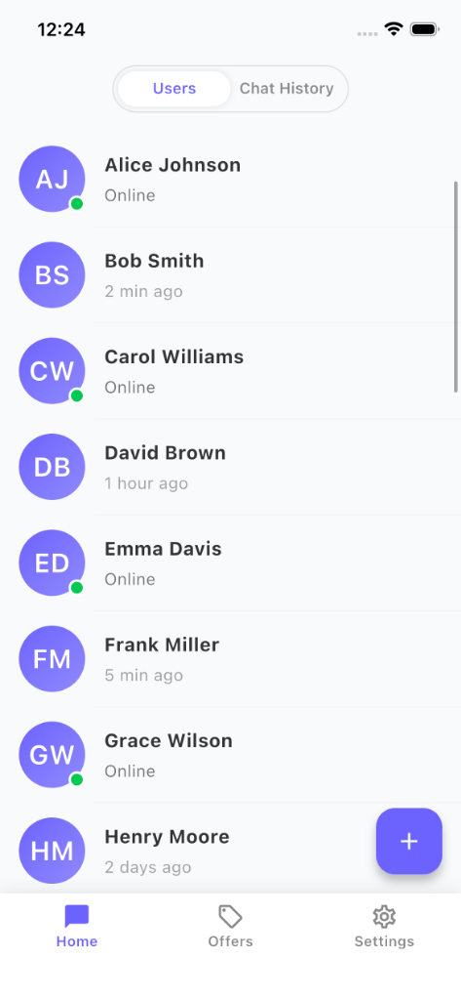
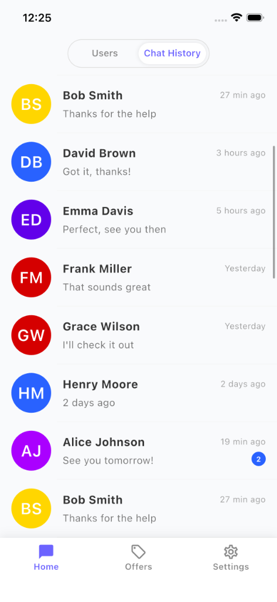
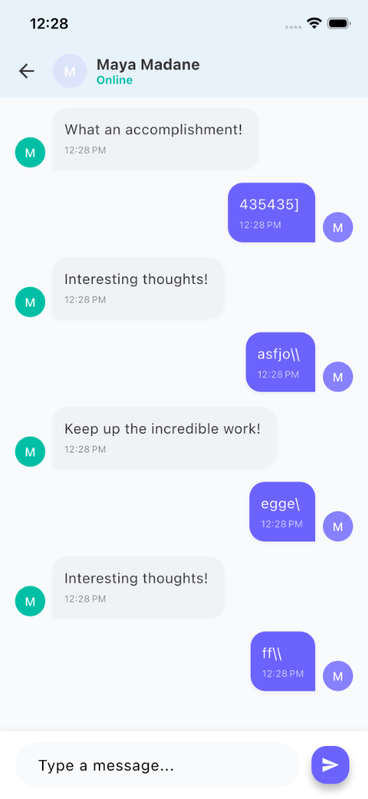
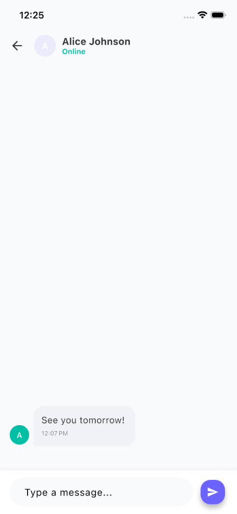
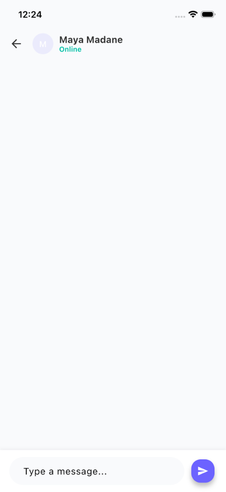

# Mini Chat App

A Flutter-based chat application demonstrating modern UI/UX principles, state management with Provider, and real-time API integration.

## Features

### 1. Home Screen

- **Two Main Tabs:**
  - **Users List:** Manage local users. Add new users via a Floating Action Button.
  - **Chat History:** View active conversations with unread counts and relative timestamps (e.g., "2 min ago").
- **Smart Header:** A custom tab switcher that gracefully scrolls away when scrolling down and snaps back when scrolling up, maximizing screen real estate.
- **Persistent State:** Scroll positions are preserved when switching between tabs.
- **Offers & Settings:** Placeholder tabs with scrollable/bouncing layouts for a consistent feel.

### 2. Chat Screen

- **Real-time Messaging:**
  - **Sender (Local):** Instant message bubbles.
  - **Receiver (Remote):** Simulates a reply after 1 second using the [DummyJSON Comments API](https://dummyjson.com/docs/comments) for realistic random text.
- **Dynamic Avatars:** Colorful avatars based on user initials.
- **Bonus Feature:** Long-press any word in a message to view its definition, powered by [Free Dictionary API](https://dictionaryapi.dev/).

## Architecture

- **State Management:** `Provider` pattern (`ChatProvider`) manages the global state of users, sessions, and messages.
- **Service Layer:** `ApiService` handles HTTP requests, ensuring separation of concerns.
- **UI Components:** Reusable widgets like `AvatarBubble` and `MessageBubble` promote code modularity.
- **Design:** Custom `AppTheme` with a premium color palette and cohesive styling.

## Testing

Run unit tests to verify state logic:

```bash
flutter test
```

## Setup

1. Clone the repository.
2. Run `flutter pub get`.
3. Run `flutter run`.

## Screenshots

| Users List | Chat History |
| :---: | :---: |
|  |  |

| Chat Conversation 1 | Chat Conversation 2 |
| :---: | :---: |
|  |  |

| Chat Details | Empty Chat |
| :---: | :---: |
|  |  |
